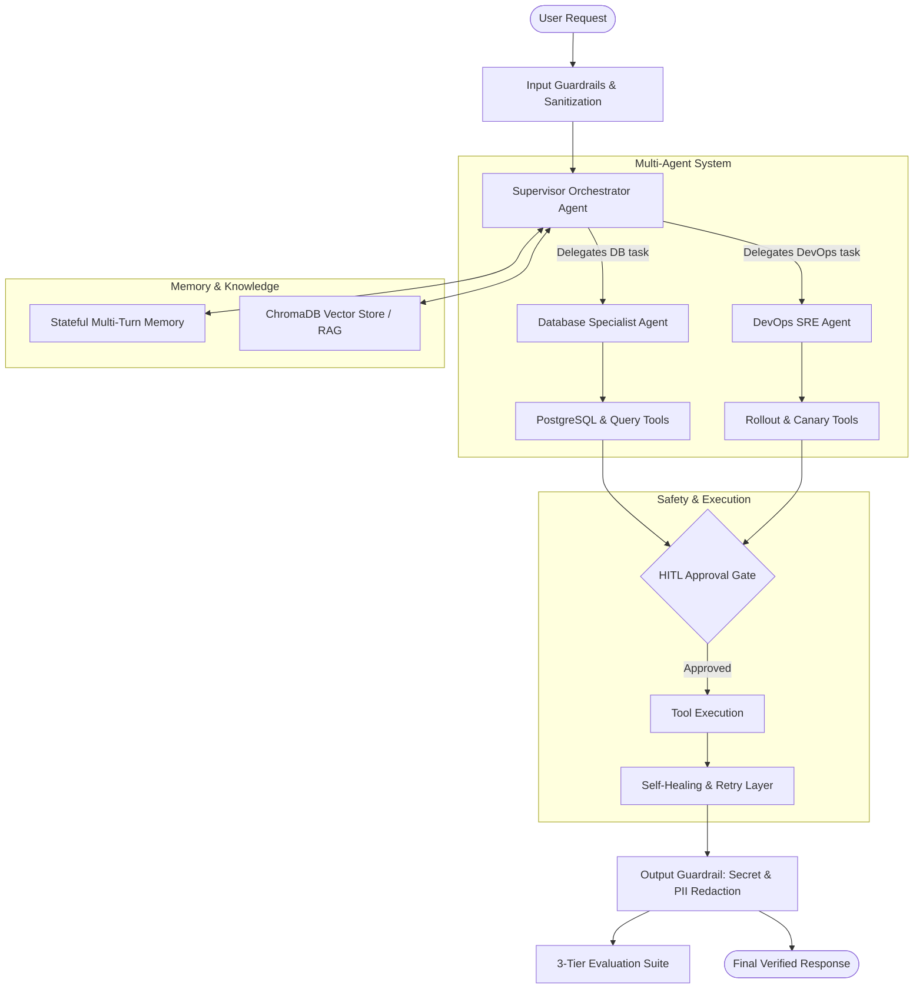

# 🤖 Agentic AI Toolkit (`agentic-ai-toolkit`)

A production-grade Python toolkit implementing core architectural patterns for **Autonomous LLM Agents** using the Google Gemini SDK (`google-genai`), ChromaDB, and modern agentic engineering principles.

Designed as an end-to-end reference implementation for engineering enterprise-ready agents capable of complex tool usage, resilient execution, safety governance, and automated evaluation.

---

## 🏗️ System Architecture



---

## 🌟 Core Modules & Patterns

| Module | Architectural Pattern | Key Capabilities |
| :--- | :--- | :--- |
| [`multi_agent.py`](file:///c:/Users/mosa/OneDrive/Desktop/Agents%20training%201/multi_agent.py) | **Supervisor Orchestrator** | Hierarchical multi-agent delegation; "Agent-as-a-Tool" pattern; cross-functional incident mitigation (DBA + DevOps). |
| [`rag.py`](file:///c:/Users/mosa/OneDrive/Desktop/Agents%20training%201/rag.py) | **Vector RAG & Retrieval** | ChromaDB integration, technical knowledge indexing, contextual retrieval with strict citation grounding. |
| [`chat_memory.py`](file:///c:/Users/mosa/OneDrive/Desktop/Agents%20training%201/chat_memory.py) | **Stateful Conversational Memory** | Multi-turn chat persistence, dynamic context management, pronoun resolution across sequential turns. |
| [`error_handling.py`](file:///c:/Users/mosa/OneDrive/Desktop/Agents%20training%201/error_handling.py) | **Resilience & Self-Healing** | Tiered error handling (local retries, exponential backoff) and returning structured feedback to LLM for autonomous recovery. |
| [`guardrails_security.py`](file:///c:/Users/mosa/OneDrive/Desktop/Agents%20training%201/guardrails_security.py) | **Security & Human-in-the-Loop** | Defense against Indirect Prompt Injection, regex-based secret/PII scrubbers, and strict human authorization gates for destructive tools. |
| [`evals_demo.py`](file:///c:/Users/mosa/OneDrive/Desktop/Agents%20training%201/evals_demo.py) | **3-Tier Agent Evaluation** | **L1:** Deterministic tool trajectory CI/CD tests; **L2:** Groundedness/faithfulness heuristics; **L3:** LLM-as-a-Judge rubric scoring. |
| [`main.py`](file:///c:/Users/mosa/OneDrive/Desktop/Agents%20training%201/main.py) | **Function Calling Agent** | Deterministic tool calling, structured JSON output validation, multi-tool calculation & synthesis. |

---

## 🚀 Quickstart Guide

### 1. Prerequisites
- Python 3.10+
- Google Gemini API Key ([Get an API key here](https://aistudio.google.com/))

### 2. Installation & Environment Setup
Clone the repository and install dependencies:

```bash
git clone https://github.com/mosayass/agentic-ai-toolkit.git
cd agentic-ai-toolkit
python -m venv .venv

# On Windows (PowerShell):
.venv\Scripts\Activate.ps1

# On macOS/Linux:
source .venv/bin/activate

pip install google-genai chromadb python-dotenv
```

### 3. Configure Credentials
Create a `.env` file in the root directory:

```env
GEMINI_API_KEY=your_gemini_api_key_here
```

---

## 🧪 Running the Components

### 1. Multi-Agent Orchestration
Demonstrates a central Supervisor agent delegating tasks to a DBA Agent and DevOps Agent to resolve a complex production outage:
```bash
python multi_agent.py
```

### 2. Security Guardrails & Human-in-the-Loop (HITL)
Tests defense against indirect prompt injection and demonstrates human operator approval gates:
```bash
python guardrails_security.py
```

### 3. Agent Evaluation Suite
Runs automated evaluations across Level 1 (Tool trajectory), Level 2 (Groundedness), and Level 3 (LLM-as-a-Judge):
```bash
python evals_demo.py
```

### 4. Stateful Conversation Memory
Runs a multi-turn chat session with context retention and tool calling:
```bash
python chat_memory.py
```

### 5. Resilient Error Handling & Self-Healing
Demonstrates how the agent handles flaky external APIs and recovers from tool execution errors:
```bash
python error_handling.py
```

---

## 🛡️ Production Engineering Best Practices Highlighted

- **Least Privilege Execution**: Critical operations (e.g. database schema alteration, user deletion) are gated behind Human-in-the-Loop (HITL) checks.
- **Data Protection**: Output sanitization scrubbers run on model completions before delivery to prevent credential leakage.
- **Deterministic Testing**: Fast, free, CI/CD-compatible evaluations verify tool selection and schema compliance without waiting for human review.
- **Fail-Safe Tool Contracts**: Tool errors return diagnostic context back to the model instead of crashing the process, enabling self-healing retry strategies.

---

## 📄 License
MIT License. Free for open-source exploration, learning, and enterprise prototyping.
